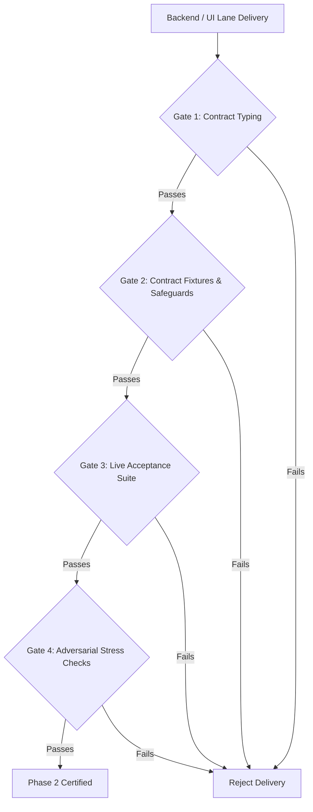

# Phase 2 Integration Audit Plan

This document provides the executable audit execution protocol for validating the Phase 2 implementation when Backend and UI lanes deliver their worktrees.

---

## 1. Audit Prerequisites and Environment Configuration

Prior to initiating live verification, confirm the following prerequisites:

| Requirement | Value / Command | Purpose |
|---|---|---|
| **Database File** | `LIVELIFT_DB_PATH=/tmp/livelift-audit.sqlite` | Isolated SQLite persistence file |
| **Server Target** | `LIVELIFT_TEST_SERVER_URL=http://localhost:3130` | Live Next.js / API route target |
| **Clean Database** | `rm -f /tmp/livelift-audit.sqlite` | Fresh room initialization |
| **Typecheck** | `npm run typecheck` in `next/` | Ensure no contract discrepancies |
| **Lint** | `npm run lint` in `next/` | Ensure code style adherence |

---

## 2. Lane Handoff Verification Gates

When a lane submits a worktree or merge candidate, it must satisfy its gate:



### Gate 1: Contract Typing & Schema Validation
- **Command:** `npm run typecheck`
- **Criteria:** 0 TypeScript compilation errors in `next/`. No modification of `next/src/contracts/authority.ts`.

### Gate 2: Contract Fixtures & Semantic Invariants (PASS NOW)
- **Command:** `npx vitest run src/__tests__/phase2/contract.fixtures.test.ts src/__tests__/phase2/semantic.safeguards.test.ts`
- **Criteria:** 24/24 tests pass. Validates wire serialization, canonical hashing, and 9 domain semantic invariants.

### Gate 3: Live Authority Acceptance Suite (INTEGRATION REQUIRED)
- **Command:** `LIVELIFT_TEST_SERVER_URL=http://localhost:3130 npx vitest run src/__tests__/phase2/authority.acceptance.test.ts`
- **Criteria:** All 18 checks pass with 0 failures and 0 skipped.

### Gate 4: Full Regression Suite
- **Command:** `npm test`
- **Criteria:** All 254 tests pass across Phase 1 and Phase 2.

---

## 3. Step-by-Step Executable Audit Protocol

### Step 3.1: Start Clean Server
```bash
rm -f /tmp/livelift-audit.sqlite
export LIVELIFT_DB_PATH=/tmp/livelift-audit.sqlite
npm run dev -- -p 3130 &
SERVER_PID=$!
sleep 2
```

### Step 3.2: Verify Server Health & Initial Snapshot
```bash
curl -s -H "X-LiveLift-Room: room-aud-01" \
     -H "X-LiveLift-Actor-Id: op-1" \
     -H "X-LiveLift-Role: operator" \
     http://localhost:3130/api/v3/room
```
- **Expected:** HTTP 200, `revision: 0`, `changed: true`, `sessions: []`, `access.role: "operator"`.

### Step 3.3: Execute Adversarial Concurrency Test (CHK-03 & CHK-07)
Send 10 concurrent HTTP requests at `expectedRevision: 0`:
```bash
# Concurrency probe script
for i in {1..10}; do
  curl -s -X POST http://localhost:3130/api/v3/room/commands \
    -H "Content-Type: application/json" \
    -H "X-LiveLift-Room: room-aud-01" \
    -H "X-LiveLift-Role: operator" \
    -d "{\"commandId\":\"cmd-race-$i\",\"roomId\":\"room-aud-01\",\"sessionId\":null,\"expectedRevision\":0,\"type\":\"create_session\",\"payload\":{\"title\":\"Race $i\",\"timezone\":\"UTC\",\"plannedStartMs\":1700000000000}}" &
done
wait
```
- **Expected:** Exactly one request commits (HTTP 200, `outcome: "committed"`). Exactly 9 requests reject with `stale_revision`. Room revision advances from 0 to 1.

### Step 3.4: Execute Idempotency & Conflict Probe (CHK-04 & CHK-05)
1. Re-POST identical command payload for the winning command ID $\to$ HTTP 200, `duplicate: true`, identical receipt.
2. Re-POST winning command ID with different title $\to$ HTTP 200, `outcome: "rejected"`, `code: "idempotency_conflict"`.

### Step 3.5: Execute Viewer Security Enforcement (CHK-08)
```bash
curl -s -X POST http://localhost:3130/api/v3/room/commands \
  -H "Content-Type: application/json" \
  -H "X-LiveLift-Room: room-aud-01" \
  -H "X-LiveLift-Role: viewer" \
  -d "{\"commandId\":\"cmd-viewer-exploit\",\"roomId\":\"room-aud-01\",\"sessionId\":\"sess-1\",\"expectedRevision\":1,\"type\":\"start_live\",\"payload\":{}}"
```
- **Expected:** HTTP 403 or `outcome: "rejected"`, `code: "forbidden"`. No write committed.

### Step 3.6: Execute Server Restart Durability (CHK-12)
1. Commit an active session with multiple recorded events.
2. Note room revision $R_{pre}$ and session state.
3. Terminate server: `kill -TERM $SERVER_PID`.
4. Relaunch server on same `LIVELIFT_DB_PATH`.
5. Poll room: verify revision is exactly $R_{pre}$, session is active, event list matches byte-for-byte.
6. Retry a pre-restart `commandId` $\to$ verify returned receipt has `duplicate: true`.

---

## 4. Blocker Triage Matrix

| Failure Symptom | Defect Origin | Blocker Severity | Remediation Mandate |
|---|---|---|---|
| Concurrent commands at revision $R$ both commit | Backend SQLite isolation | **CRITICAL (BLOCKER)** | Replace deferred transaction with `BEGIN IMMEDIATE`; serialize room write transactions. |
| Client `localStorage` commits REAL session | UI Store implementation | **CRITICAL (BLOCKER)** | Sever local storage for REAL environment; route all state transitions through remote authority. |
| Viewer role executes write command | Backend capability check | **CRITICAL (BLOCKER)** | Enforce server-side role check prior to transaction execution. |
| `stale_revision` increments room revision | Backend error logging | **HIGH** | Terminal rejections must be persisted to `command_log` without bumping `room_state.revision`. |
| Outdated polling response overwrites current UI state | UI polling store | **HIGH** | Drop incoming room snapshots where `snapshot.revision < installedRevision`. |
| Command response loss leaves client in permanent failure | UI reconnection store | **HIGH** | Query `GET /api/v3/room/commands/<id>` on reconnect; treat unacknowledged commands as UNKNOWN, not failed. |

---

## 5. Audit Certification Criteria

The Phase 2 verification package certifies the implementation lane when:
1. `ACCEPTANCE_MATRIX.md` items CHK-01 through CHK-18 have objective test evidence.
2. `npm run typecheck`, `npm run lint`, and `npm test` execute with zero errors.
3. No manual workarounds or relaxed test assertions exist.
